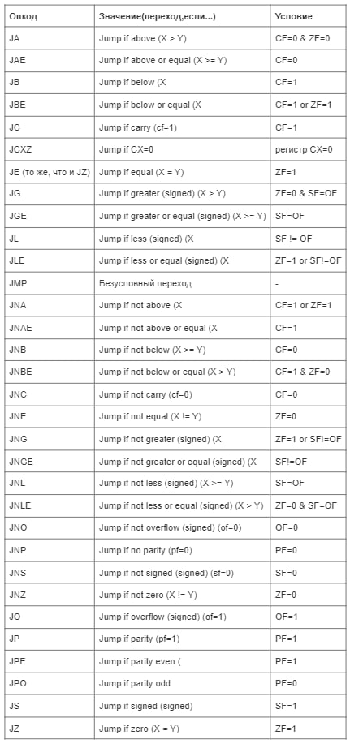

Сборка примеров программ с помощью `make`: `make PROG_NAME`, например `make sum`. Исполняемый файл будет в `out/PROG_NAME`.

# sum
Программа читает 2 32-битных знаковых числа и выводит их сумму.

# t1
*64-битная арифметика с учетом CF, sign-extension.*

Программа читает c stdin знаковые 32-битное и 64-битное число и выводит их сумму.
В случае знакового переполнения программа печатает -1.
Если числа считать не удалось, программа печатает 0.

# t2
*Проверка четности, условные переходы.*

Collatz calculator. Принимает на вход первое положительное число последовательности (назовём его C[0]).
Следующее число С[n+1] вычисляется так: если предыдущее C[n] чётное, то C[n+1] = C[n]/2, иначе C[n+1] = 3*C[n]+1.
Программа печатает числа последовательности. При достижении C[...] = 1 программа останавливается.
Если при вычислениях возникает переполнение, программа печатает нуль и тоже останавливается.

# t3
*Взятие остатка по модулю 2**N.*

Gadalka. Программа принимает на вход число N, вычисляет z = N mod 128 и предлагает пользователю угадать z за несколько попыток.
Если пользователь вводит число, большее z, программа печатает “-1”; если меньшее — “1”; если пользователь угадал, программа печатает “0” и останавливается.

